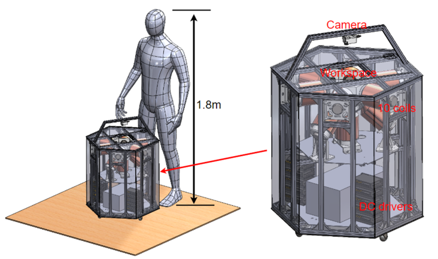
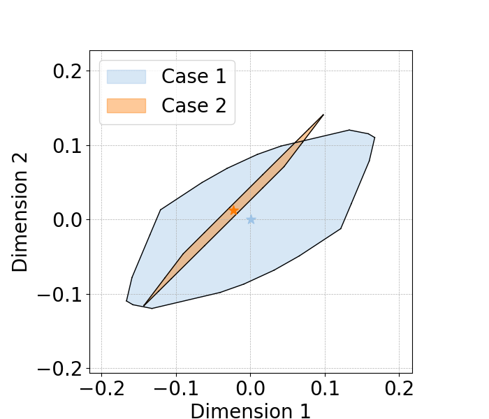
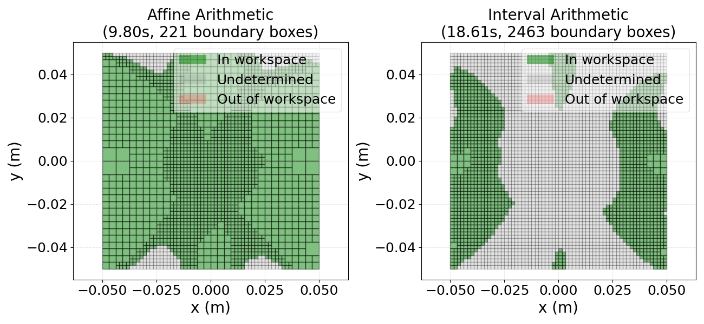
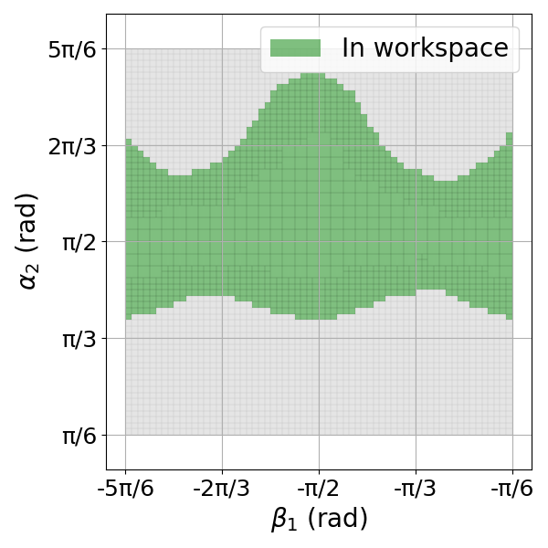

# Workspace for Multi-target Electromagnetic Control

Supplementary code for the paper **"Electromagnetic control of multiple microrobots within certified feasible workspaces"**.

This repository provides reproducible examples for workspace analysis in a 10-coil electromagnetic actuation system, including interval and affine arithmetic based methods.

## Overview

This codebase includes three representative examples:

1. Multi-target actuation-feasible workspace analysis (magnetic field / wrench related constraints).
2. Task-feasible workspace comparison between affine and interval methods.
3. A 2-DOF microrobot arm case study for certified workspace computation.

Core utility libraries for electromagnetic modeling and set-based analysis are also included:

- `WS_lib.py`
- `WS_lib_Affine.py`
- `WS_lib_Interval_fast.py`
- `Check_lib.py`
- `custom_interval.py`
- `custom_affine.py`

## Electromagnetic Coil System

The electromagnetic actuation platform used in this study is shown below:

 

## Environment Setup

Recommended: Python 3.9+ in a virtual environment.

```bash
pip install numpy scipy sympy matplotlib pypoman
```

Then run scripts directly, for example:

```bash
python AFW_2D.py
python Comparsion.py
python Case_study.py
```

## 1) Actuation-feasible Workspace Example

File: `AFW_2D.py`

This example computes and visualizes 2D feasible hulls for two target magnets under selected actuation outputs.

A target magnet is configured as:

```python
{
  'X': 0.02, 'Y': 0.02, 'Z': -0.03,
  'm': 0.2,
  'alpha': np.pi/2, 'beta': np.pi/2,
  'Bx': True, 'By': None, 'Bz': None,
  'Bx_dx': None, 'Bx_dy': None, 'Bx_dz': None,
  'By_dy': None, 'By_dz': None,
  'fx': None, 'fy': None, 'fz': None,
  'tx': None, 'ty': None, 'tz': None,
}
```

Set an actuation item to `True` to include it in the workspace projection; set to `None` to exclude it.

Example output:



## 2) Affine vs Interval Comparison (Task-feasible Workspace)

File: `Comparsion.py`

This script compares affine and interval approaches for a 2D task set in the same coil system.

Task requirement:

$$
\mathcal{C}=\{\mathbf{b} \in \mathbb{R}^2 \mid -0.08 \leq b_x \leq 0.08\,\mathrm{T},\ -0.08 \leq b_y \leq 0.08\,\mathrm{T}\}
$$

Example output:



## 3) 2-DOF Microrobot Arm Case Study

File: `Case_study.py`

This script computes the task-feasible workspace for a 2-DOF microrobot arm and supports multi-core acceleration.

Task requirement:

$$
\mathcal{C}=\{\mathbf{b} \in \mathbb{R}^6 \mid
b_{x,1}=0,\ b_{y,1}=0,\ b_{z,1}=0.02\,\mathrm{T},\
b_{x,2}=0,\ b_{y,2}=0,\ b_{z,2}=0.03\,\mathrm{T}
\}
$$

Example output:



### Key parameters

1. Configuration domain:

```python
beta1 = interval[-5/6 * math.pi, -1/6 * math.pi]
alpha2 = interval[1/6 * math.pi, 5/6 * math.pi]
```

2. Coil current bounds (with interaction term enabled):

```python
I_intervals = create_I_intervals(11, custom_bounds={10: (1, 1)})
```

If interaction is disabled:

```python
I_intervals = [interval[-15, 15]] * 10
```

3. Bisection resolution:

```python
eps = 0.05
```

4. Number of CPU processes:

```python
num_processes = min(mp.cpu_count(), 16)
```

## Notes

- On Windows, `Case_study.py` already includes `mp.freeze_support()` for multiprocessing compatibility.
- If your machine has fewer resources, reduce `num_processes` and increase `eps` to shorten runtime.